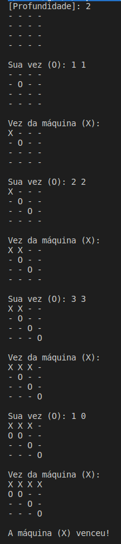

# Jogo da Velha com Minimax

Este é um projeto que implementa um jogo da velha onde você pode jogar contra uma inteligência artificial que utiliza o algoritmo minimax para decidir seus movimentos.

## Descrição

Um jogo da velha com as mesmas estratégias do padrão para dois jogadores, X e O, que alternam fazendo jogadas em um tabuleiro de 4x4. O objetivo é conseguir 4 símbolos consecutivos (X ou O) em linha, coluna ou diagonal.

Este projeto implementa uma versão do jogo da velha em C++, onde você pode jogar contra a IA que utiliza o algoritmo minimax para determinar suas jogadas. Com um limitador de profundidade de jogadas possíveis definida no início do jogo, entre 1 a 6. A partir de 6 o algoritmo exige muito da CPU.

## Funcionalidades

- Jogue contra a IA que utiliza o algoritmo minimax para tomar decisões.
- Define o nível de profundidade da árvore de jogadas possíveis.
- Interface de linha de comando simples e intuitiva.
- O código é modular e fácil de entender, facilitando a extensão e a manutenção.

## Como Jogar

1. Clone o repositório:
  ```
  git clone https://github.com/gabrielsizilio/jogo-da-velha
  ```
1. Compile o código-fonte ``main.cpp`` utilizando um compilador C++.
2. Execute o programa resultante.
   ```
   cd jogo-da-velha/output
   ./main
   ``` 
4. Siga as instruções na tela para fazer suas jogadas. Quando `Sua vez(O):` digite 2 inteiros ( `linha` `coluna` ) de 0 a 3 para escolher uma posição no tabuleiro
   
   

## Pré-requisitos

- Um compilador C++.
